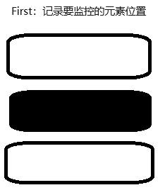
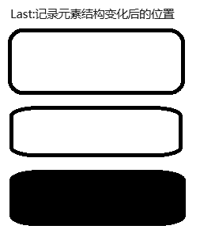

### Flip动画效果

#### 最终效果
::: tip

该效果为拖拽排序最终效果，如需了解拖拽排序实现过程请跳转至拖拽排序目录浏览。

:::

 [演示案例](https://tutouguai.cn/PressDemo/two/index.html)

#### 原理
::: tip

通过dom变换后更改transform，在对transition进行赋值，他就会从起始位置移动至目标位置

:::

1、首先需要将元素起始位置与目标位置记录






2、将变化前的位置减去变化后的位置，这样就得到了一个transform的差值，并且给新dom添加这个差值，目前元素其实已经到了目标位置但是因为transform的影响我们看到的还是在原来的位置

3、给dom添加transition属性并且清除transform，这样他就会通过动画回到原来的位置

通过Flip也可以进行其他的动画操作 ，例如旋转、缩放

 #### 实现

 ```js
class Flip{
    constructor(dom,time){
        this.dom=dom
        this.time=time
        Array.from(this.dom).forEach(res => {
            //保存当前top位置
            res.top=res.offsetTop;
            
        });
    }
    play(){
        Array.from(this.dom).forEach(res => {
            //保存当前top位置
            let dis= res.top - res.offsetTop
            res.style.transform = `translateY(${dis}px)`
            //判断有没有transition属性有的话就删除否则第二次移动效果会消失，因为flip是先将元素已到目标地点在开启transtion后通过transform属性改变会出现动画效果
            if(res.style.transition){
                res.style.removeProperty('transition')
            }
            //通过requestAnimationFrame进行添加transition。
            this.RAF(()=>{
                res.style.transition = `transform ${0.3}s`
                res.style.removeProperty('transform')
                
            })
            //移动后保存当前的top位置方便下一次移动
            res.top=res.offsetTop;
        });
        
    }
    RAF(callback){
        requestAnimationFrame(()=>{
            requestAnimationFrame(callback)
        })
    }
}
 ```