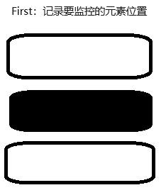
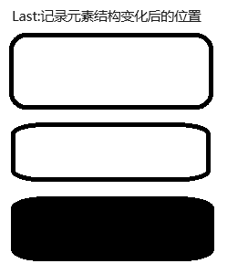

### Flip animation effects

#### Final effect
::: tip

This effect is the final effect of drag and drop sorting. If you need to understand the implementation process of drag and drop sorting, please go to the drag and drop sorting directory to browse.

:::

 [Demonstration case](http://tutouguai.cn/PressDemo/two/index.html)

#### principle
::: tip

After changing the 'transform' through the 'dom' transformation, when assigning a value to the 'transition', it will move from the starting position to the target position

:::

1、Firstly, it is necessary to record the starting position and target position of the element






2、Subtract the position before the change from the position after the change to obtain a difference in 'transform', and add this difference to the new 'dom'. Currently, the element has actually reached the target position, but due to the influence of 'transform', what we see is still at the original position

3、Add a 'transition' attribute to 'dom' and clear 'transform', so that it will return to its original position through animation

Flip can also be used for other animation operations, such as rotation and scaling

 #### achieve

 ```js
class Flip{
    constructor(dom,time){
        this.dom=dom
        this.time=time
        Array.from(this.dom).forEach(res => {
            //Save the current 'top' position
            res.top=res.offsetTop;
            
        });
    }
    play(){
        Array.from(this.dom).forEach(res => {
            //Save the current 'top' position
            let dis= res.top - res.offsetTop
            res.style.transform = `translateY(${dis}px)`
            //If there is a 'transition' attribute, delete it. Otherwise, the second movement effect will disappear, because 'flip' first moves the element to the target location, opens' transition ', and changes it through the' transform 'attribute to create an animation effect
            if(res.style.transition){
                res.style.removeProperty('transition')
            }
            //Add 'transition' through 'requestAnimationFrame'.
            this.RAF(()=>{
                res.style.transition = `transform ${0.3}s`
                res.style.removeProperty('transform')
                
            })
            //Save the current 'top' position after moving to facilitate the next move
            res.top=res.offsetTop;
        });
        
    }
    RAF(callback){
        requestAnimationFrame(()=>{
            requestAnimationFrame(callback)
        })
    }
}
 ```